<h1>software engineer</h1>

Passionate about building scalable and efficient web applications, I am a Senior Full-Stack Engineer with 10+ years of experience and a Master’s degree in Computer Science. My expertise spans Ruby on Rails, JavaScript, Node.js, React, Vue.js, and Elixir, allowing me to deliver robust solutions across industries like healthcare, fintech, real estate, eCommerce, media streaming, and enterprise software. I take pride in writing clean, maintainable, and well-tested code that enhances user experiences and drives business growth. Always eager for new challenges—let’s connect and explore how I can contribute to your next big project!

  

  

  

	
	
</a>

  

<table>
  <tr>
    <td></td>
    <td></td>
    <td></td>
    <td></td>
    <td></td>
    <td></td>
    <td></td>
    <td></td>
    <td></td>
    <td></td>
    <td></td>
    <td></td>
  </tr>
  <tr>
    <td></td>
    <td></td>
    <td></td>
    <td></td>
    <td></td>
    <td></td>
    <td></td>
    <td></td>
    <td></td>
    <td></td>
    <td></td>
    <td></td>
  </tr>
  <tr>
    <td></td>
    <td></td>
    <td><a href="https://laravel.com/" target="_blank" rel="noreferrer">  </td>
    <td></td>
    <td></td>
    <td></td>
    <td></td>
    <td></td>
    <td></td>
    <td></td>
    <td></td>
    <td> </td>
  </tr>
</table>
